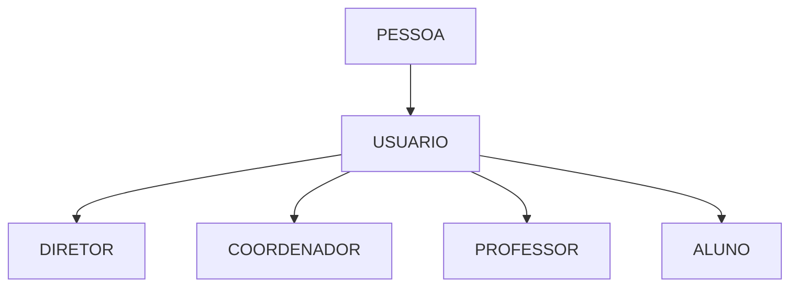

# Projeto Escola

## Objetivo

       Aprendizado desenvolvimento Web com SpringBoot.

## Estrutura View

    ├── Home/DashBoard
    |
    ├── Usuarios:
    │    ├── Responsaveis/Pais alunos
    │    ├── Aluno
    │    │    └── View::Notas/Avaliações
    │    ├── Professor
    │    │    ├── View::Tumas/Notas/avaliações/Alunos
    │    │    └── Insert::Notas/Avaliações
    │    ├── Diretor
    │    │    ├── View::Tumas/Notas/avaliações/Alunos/Professor/Coordenador
    │    │    └── Create::Alunos/Turmas/Professor/Coordenador
    │    └── Coordenador
    │         ├── View::Tumas/Notas/avaliações/Alunos/Professor/
    │         └── Create::Alunos/Turmas/Professor/
    |
    └── Disciplina
         ├── Avaliação
         ├── Turma
         └── Curso

### Struct Flow

